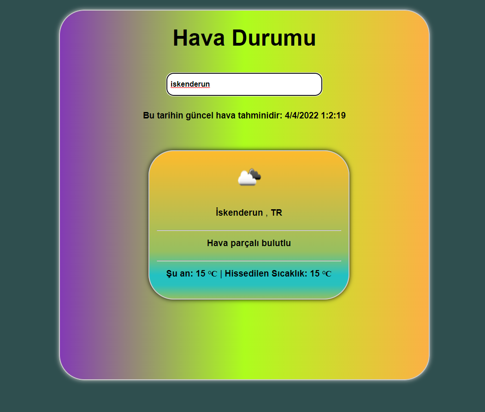

<h1>Hava Durumu Uygulaması</h1>

 
 

 
<h2> Kullanılan yöntemler</h2>

<li> Vite.js</li>

<li> Context Api</li>

<li> Veriler için <a href="https://openweathermap.org/"> openweather</a> 'dan yararlanılmıştır.</li>
